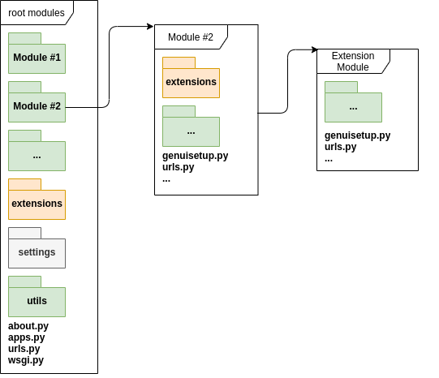

..  _dev-guide-index:

GenUI Developer Guide
=====================

This short tutorial will show you how to extend the GenUI backend framework with new applications
and features. We will describe the Python API to create extensions first
and then move on to discussing specific feature implementations. This
guide assumes you already know a little bit about how the Django web framework
works. Skimming through the `official Django tutorial <https://www.djangoproject.com/start/>`_
should be enough to get you started. We also assume that you have already installed
and can run the GenUI backend applications as described in :ref:`install-guide-from-source`.

Extensions
----------

Extensions are nothing special in GenUI. A GenUI extension is nothing more than a basic Django application with
a few extras that can make your life a bit easier when integrating the application with the rest of the framework.
Here is a high level overview of the GenUI project structure:

    Overview of the GenUI project structure. The packages (Django applications) on top of the hierarchy are called
    *root packages* and they can have any number of subpackages. A special subpackage is the *extensions* package,
    which contains applications extending the GenUI framework.

Each *root package* has its function in the framework and also it's own submodules and subpackages.
A special kind of subpackage is the *extensions* subpackage. This is a place where applications that are
not part of the GenUI Python API are placed. These are packages implementing molecular generators,
machine learning algorithms for QSAR and dimensionality reduction, but also data import options
and other functionality. In short, extensions are Django applications not necessary for the
operation of the GenUI framework itself, but rather applications that only depend on it.

So far you need to place your extensions into these predefined directories. However,
soon there will be a feature that will allow you to mark any directory as
containing additional extensions.

..  todo:: Add info about this feature when it is implemented.

..  _dev-guide-create-extension:

Creating an Extension
~~~~~~~~~~~~~~~~~~~~~

In order to create an extension, you have to create its root directory first.
Lets say we would like to create an extension that contains a collection of new
QSAR models that we would like to expose in the GenUI REST API. We will name
this extension :code:`qsarextra` (see :ref:`dev-guide-create-qsar-ext`).
In order for everything to work,
we will have to place it in the :code:`genui/qsar/extensions`
directory. On Linux we would create this directory on command
line like this from the repository root:

..  code-block:: bash

    mkdir src/genui/qsar/extensions/qsarextra

Then we can make use of the Django :code:`manage.py` command to bootstrap this application for us:

..  code-block:: bash

    cd src/
    python manage.py startapp qsarextra qsar/extensions/qsarextra

This will generate the proper directory structure under :code:`genui/qsar/extensions`.
Now we just need to add a few extras to make this package into a GenUI extension.
All it takes is the :code:`genuisetup.py` script in :code:`genui/qsar/extensions/qsarextra/`.
This module is recognized by the :code:`genuisetup` command, which is responsible for
properly initializing extensions. A typical :code:`genuisetup.py` looks something like this:

..  code-block:: python

    """
    genuisetup.py in src/genui/qsar/extensions/qsarextra/

    """

    PARENT = 'genui.qsar'

    def setup(*args, **kwargs):
        pass

The :code:`PARENT` variable is used to denote the root package we are extending
and the :code:`setup` method is triggered by the :code:`genuisetup` command
and later in this tutorial we will use it to set default permissions for
the data structures we create and to tell the GenUI framework about the
new stuff we implemented.

The last thing we have to do is make our extension discoverable by
including it in the :code:`__init__.py` script of the :code:`qsar.extensions`
package:

..  code-block:: python

    """
    __init__.py in src/genui/qsar/extensions/

    """

    __all__ = ('qsarextra',)

When you run the :code:`genuisetup` command with :code:`manage.py`:

..  code-block:: bash

    # setup the extensions and detect new features
    python manage.py genuisetup

you should find a new message in the output informing you about your new extension being successfully setup:

..  code-block::

    Successful setup for: "genui.qsar.extensions.qsarextra"

..  note:: If you created new models in your extensions, do not forget
    to generate migrations and migrate the database when appropriate:

    ..  code-block:: bash

        # migrate the database if needed
        python manage.py makemigrations
        python manage.py migrate

Extending the GenUI Applications
--------------------------------

In the following tutorials, you will learn the specific details of implementing
extensions for various GenUI applications.

.. toctree::
   :maxdepth: 1

   qsar
   compounds
   generators
   maps